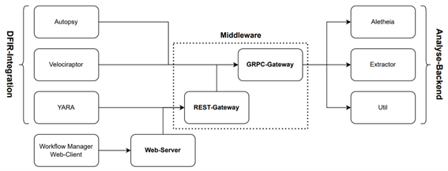

## DFIR Steg Hub
### Installation using Docker

1. docker-compose build
2. docker-compose up -d

### Architecture

The Architecture consists out of clients, gateways, a webserver and multiple services. Clients can send requests via the grpc or the rest gateway to execute the whole workflow or a single service.



Clients can eather send a StegAnalysisRequest (see [steg_analysis.proto](common/proto/steg_analysis.proto) ) to the grpc gateway or a get request to the rest gateway.

### Workflow-Manager

The **Workflow Manager** is a web application designed to simplify the configuration and management of analysis workflows for steganalysis tasks.


To configure the Workflow:

1. Go to localhost (port 80 is default for the web server)
2. Edit the workflow in the editor or upload an existing yaml file
3. Test the workflow
   - Click choose file
   - Click execute

#### Key Features

##### 1. Workflow Editor
- View and edit the current workflow YAML file stored in the gRPC gateway
- Save changes directly via the web interface
- Upload existing workflow files for easy switching between configurations
- Demo mode for previewing syntax and configuration examples

##### 2. Test Component
- Run a steganalysis using a selected image with the current configuration
- Instantly view results to validate setup
- Supports error analysis before deploying workflows in production

##### 3. Services Component
- Displays all registered steganalysis services
- Shows detailed information about supported functions, parameters, and return values

#### Workflow Syntax

Workflows are defined in a **YAML file** structured into two main sections:

##### Global Settings
- `task_timeout_in_sec`: Timeout for individual tasks (in seconds)
- `workflow_timeout_in_sec`: Timeout for the overall workflow (in seconds)
- `max_concurrent_req`: Maximum number of concurrent requests
- `max_file_size_in_kb`: Maximum file size allowed (in KB)
- `allowed_file_types`: List of supported file formats
- `toggle_output`: Enable/disable output for all tasks

##### Task Execution & Control
- **sync / async groups** for sequential or parallel execution
- **Iterators (`iter`)** to loop over lists or dictionaries
- Each task is defined using the `exec` field (e.g., `aletheia.auto`)

##### Task Configuration Options
- `name`, `cond`, `file`, `param`, `return`, `hide`, `hide_on_err`
- `additional_return_fields`, `show_output`

##### Conditional Logic & Expressions (`cond`)
- Built-in support for [govaluate](https://github.com/Knetic/govaluate) expressions
- Supported functions: `strlen`, `strcontains`, `toNumber`, `isNull`, `listContains`, `containsKey`, etc.
- Special control structures like `condReturn`, `safe`, and more

#### Example
```yaml
workflow_timeout_in_sec: 60
tasks:
  - sync:
      - exec: aletheia.auto
      - exec: detector.run
```


### Using the Yara Client

In order to use Yara as a client you must create a custom module, follow the insturctions in the yara docs. Copy [stego.c](clients/Yara/stego.c) to the libyara project, register the class and compile the whole solution. In the future there will be precompiled binaries for demo purposes.

### Using the Velociraptor Client

Import the [Stego Artifact](clients/Velociraptor/Stego.yaml) and upload the [GRPC Connector](clients/Velociraptor/grpc_client.go) in the Tools section.
Collect the artefact on a single client or as a hunt and specify the requiered parameters such as gateway address and directory or file.

### Using the Autopsy Client

Install the [Steganalysis Plugin](clients/Autopsy/Steganalysis/) in Autopsy. Run the Plugin, the Results will be shown in the Blackboard.

### Implementing new Clients

#### GRPC Client

Protobuf files for python, cpp, go and java are already generated and can be copied to your client [common/pb/](common/pb/). Then you can send a StegAnalysisRequest to the grpc endpoint to execute the workflow.

#### HTTP Client

Send a GET request to the rest gateway:

- Address: /execute
- Body: form-data (needs a file key which contains the file to analyze)

### Implementing new Services

1. Import the proto files in your desiered language to your service.
2. Implement the requierd server methods (Execute, GetStegServiceInfo).
3. Register the service in the grpc gateway by adding the endpoint to the services env (if you are using docker you can add is directly in docker-compose.yaml).
4. Restart the grpc server.

#### This project was part of my master's thesis, titled ["Konzeption zur Erweiterung von Digital Forensics und Incident Response Tools zur Analyse bildbasierter Stegomalware."](https://github.com/user-attachments/files/20820326/Masterarbeit_Ohlhof.pdf)
